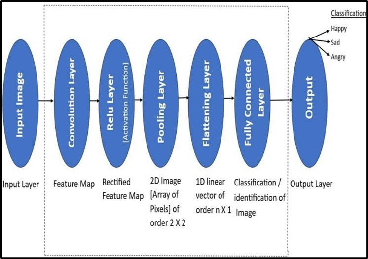

# Face Emotion Detection with CNN and ResNetB0

Welcome to the GitHub repository for our project on Face Emotion Detection using Convolutional Neural Networks (CNNs) in conjunction with ResNetB0. This project aims to classify facial expressions into different emotions, including happiness, sadness, anger, disgust, surprise, and neutrality.

## Table of Contents

- [Introduction](#introduction)
- [Methodology](#methodology)
- [Results](#results)
- [Setup and Installation](#setup-and-installation)


## Introduction
Emotion recognition from facial expressions is an important aspect of human-computer interaction and psychological research. This project leverages deep learning techniques to build a robust model for detecting emotions from facial expressions in real-time. Our model uses Convolutional Neural Networks (CNNs) to automatically extract features from facial images and ResNetB0 to enhance its accuracy and performance.


## Methodology
The core of our model consists of the following components:
- **Convolutional Layers**: To extract local features from facial images.
- **Pooling Layers**: To reduce the dimensionality of the data.
- **ReLU Activation**: To introduce non-linearity.
- **Fully Connected Layers**: For emotion classification.
- **Softmax Layer**: For outputting the emotion probabilities.



The model is trained on a comprehensive dataset containing a wide range of facial expressions. Data augmentation techniques, such as rotation, flipping, and cropping, are applied to increase the dataset's diversity and reduce overfitting.

## Setup and Installation
To set up this project locally, follow these steps:
1. Clone the repository: 
```bash
git clone https://github.com/Anonymous15052003/Human_face_emotion_recognition_model_using_CNN.git
```

2. Install the required dependencies. You can use `pip` to install the necessary packages:
```bash
pip install -r requirements.txt
```

## Results
The proposed model generates the output with 98% accuracy with input layers of shape [224, 224, 3] using the GlobalMaxPooling2D for pooling and softmax for the output layers and cross entropy is calculated using the Adam optimizer.

Our model demonstrated accurate output generation, correctly identifying happiness. Subsequently, during testing with an image of an angry person, our model continued to exhibit precision by accurately predicting the emotion as 'angry'.

This indicates the robustness and reliability of our model in accurately classifying a range of emotions, showcasing its effectiveness across diverse scenarios.


